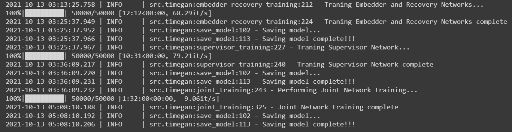
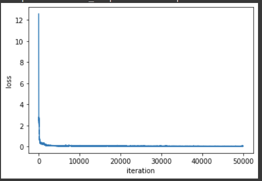
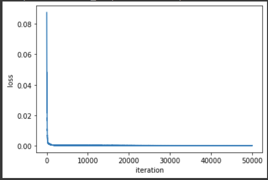
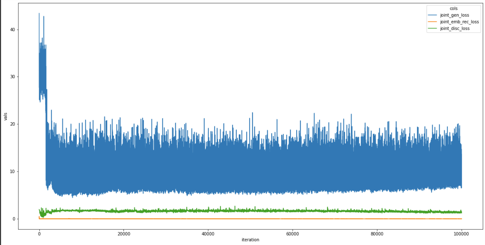
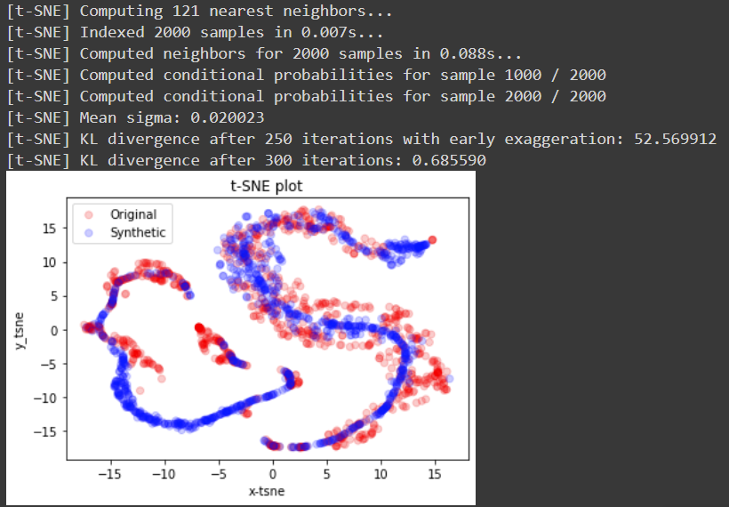
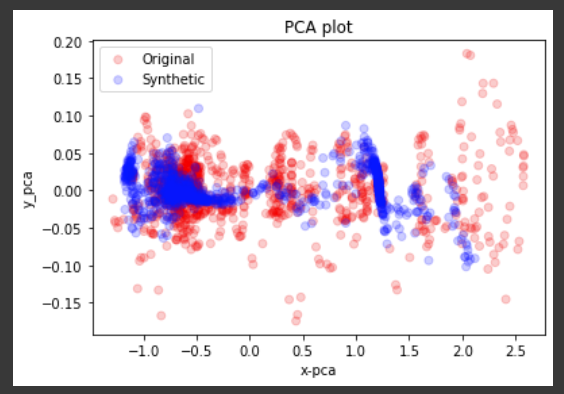

# TimeGANPyTorch

This repo contains the PyTorch implementation for TimeGAN network.

Here is the original TensorFlow implementation:
https://github.com/jsyoon0823/TimeGAN

## Usage:
Example for training on the Stock Dataset:
```
from src import TimeGAN


model_params = {
    "hidden_dim":24,
    "num_layer":3,
    "iterations":50000,
    "batch_size":128,
    "module":"gru",
    "sequence_length":24,
    "learning_rate":1e-3,
    "dataset":"stock",
}

model = TimeGAN(model_params)

model.train()
```


## Loss
The log file loss of each of the 4 networks can be found in the `log_<TIMESTAMP>` directory in the code root folder. See the paper for the network details.

### Embedder-Recovery Training


### Supervisor Training


### Joint Generator, Emberdder-Recovery, Discriminator


## Synthetic Data generation
```
fake_data = model.synthetic_data_generation()
```

## Visualization
Check the paper for details about visualization
```
from src.viz import visualization
```

### TSNE
```
visualization(model.dataloader.data, fake_data,"tsne")
```


### PCA
```
visualization(model.dataloader.data, fake_data,"pca")
```
